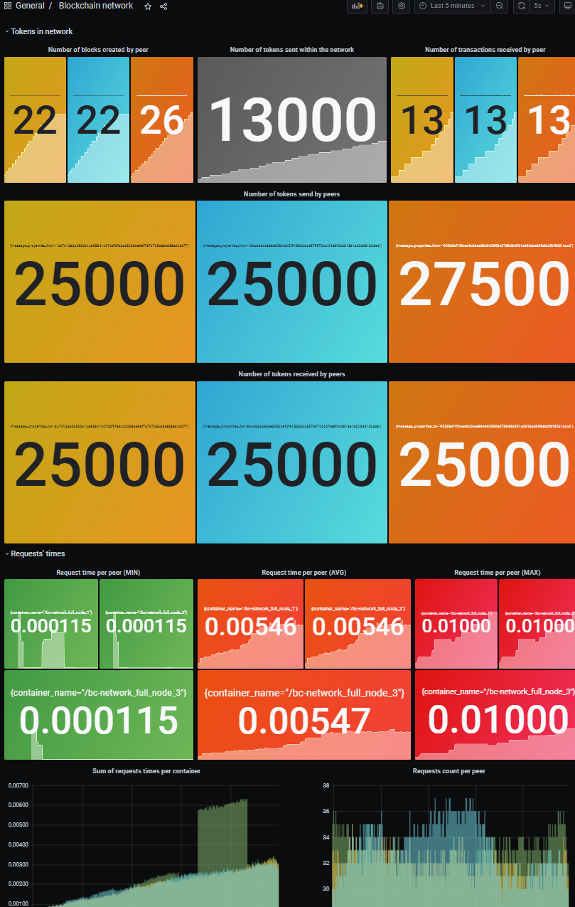

# About the project

Hello World!

`bc-network` is an implementation of very naive and simple blockchain network. I started building it to learn and understand basic concepts. The current solution uses proof of work algorithm to process transactions.

Some architectural decisions are going to be placed in `docs` folder so you could better understand why I made it this way.

The application is consisting of two systems:
* monitoring (built with loki/fluent-bit/grafana)
* blockchain (discovery node + full nodes)

## How to run it

### 0. Prerequisite

In order to run the application you need to have `docker` and `docker-compose` installed.

I am running this setup on my machines using:
* Docker version 20.10.5, build 55c4c88
* docker-compose version 1.29.0, build 07737305

### 1. Monitoring

Run this command in terminal:
```sh
docker-compose -f monitoring-docker-compose.yml up
```
Open your web browser and enter http://localhost:3000 and log in with given credentials:
* username: admin
* password: admin

After login in you will be asked to change password but you may leave it as it is.

### 2. Blockchain

Run this command in terminal:
```sh
docker-compose up --scale full_node=3
```

Go back to your Grafana dashboard in your browser and choose dashboard `Blockchain network`.

From there, you should start seeing Grafana populate with data from the blockchain.




